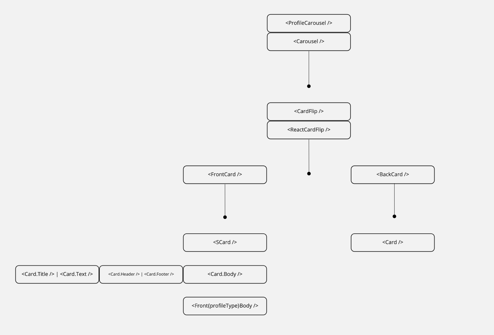
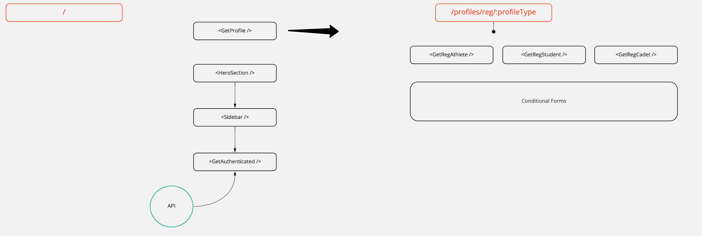
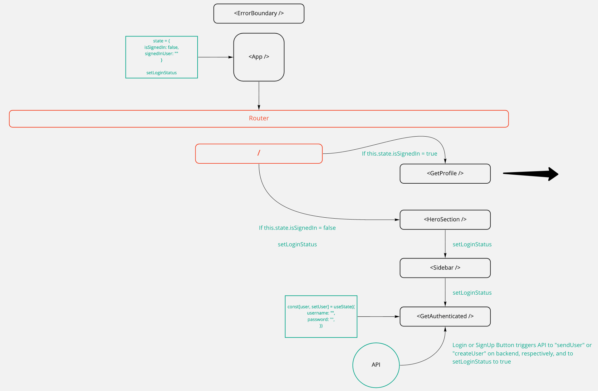
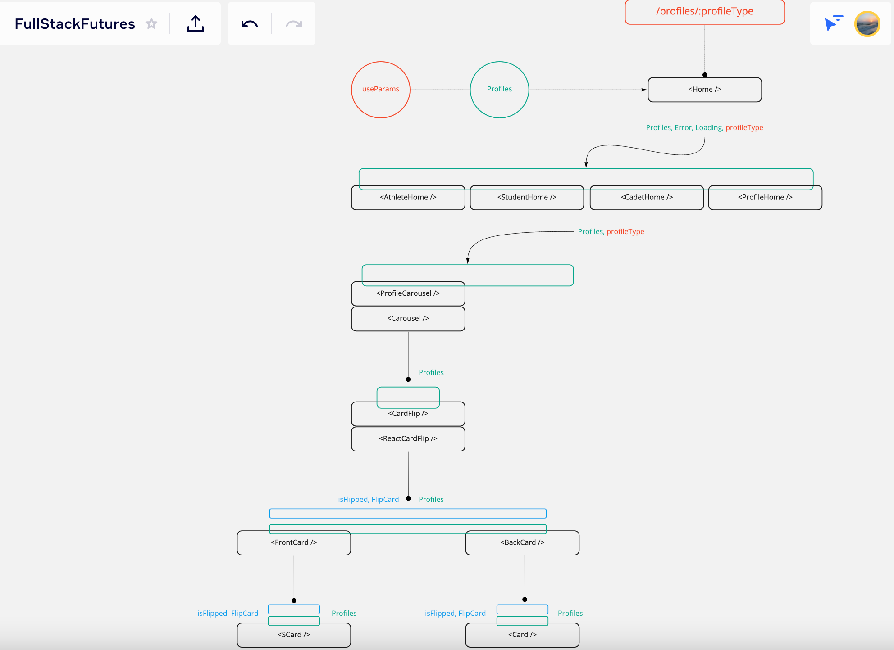

A couple months ago, when I was attending Case Western Reserve University's (Ohio) software development program, I was introduced to Facebook's React.js for the first time. And it totally changed the way I thought about web applications and more specifically, what I thought about User Interface design and development.

> React is a Javascript Library that forces you to think in terms of components.

My introduction to React.js also changed the way I think about data flow and data management within a web application. In React, data management is part of state management, and state management is one of the most fundamental _problems_ in programming.

When I was designing and building my first web application, that implemented the entire MERN stack architecture, I quickly realized the need to visualize not only the overall structure of the application, but also the data flow.

Let me show you some of the visualizations I used to best understand the architecture of my FullStackFutures web application.

Table of Contents

- [My Component Tree](#My-Component-Tree)
- [Identify Where Your State Should Live](#Identify-Where-Your-State-Should-Live)

## My Component Tree

So I am thinking you have read the saying - "Thinking in React" - before. Well, there it is again. But what does that really mean? To me, it is more than just understanding what components are; it means you have to think about the app as you build it. One way to accomplish this is to create your **Component Tree**.


Alright, let's break this part down. Starting at the top, we can immediately see the application has React Router set up. And two routes are on display.

### Root Route

The Root Route (forward slash) is what you would see when you navigate to the root (index) of the application. You can also see that when you are on the root of the application, you are either presented with the _GetProfile_ component or the _HeroSection_ component. We will get into conditional rendering later on.

### Profiles Route

The other route pictured is a dynamic route that accepts a single param, _profileType_. The _Home_ component is the key here, and serves as this route's command center. The _Home_ component will determine which downstream component branch you will enter:

1. **AthleteHome**

1. **StudentHome**

1. **CadetHome**

1. **ProfileHome**

Each "ProfileHome" Page Component numbered above will launch a series of localized components to render the _ProfileCarousel_ and _Carousel_ components. You can see even more layers on these branches below.



### Root Route - Conditional Rendering

Now, let's revisit the conditional rendering portion of the root route (/). If the end user of the application is "signed in" and authenticated (passport) to visit the site, they will be presented with the _GetProfile_ component which will allow the user to create a site profile that will be associated with the user's account. Otherwise, if the user is not authenticated, they will be guided through the GetAuthenticated workflow. Following the completion of the GetAuthenticated workflow and is signed in, the user will then be presented with the _GetProfile_ component. Pretty cool!

### One More Route - Reg Route

So... I have one more route too. It is pictured below and is also a dynamic route that accepts a single param, _profileType_. This route is called upon from the _GetProfile_ component and aligns with the profile type that you have selected to create, once you are authenticated to use the site.

For example, if you select the AthleteProfile from the _GetProfile_ component, you will be presented with the _GetRegAthlete_ component, which is essentially just a registration form for the specified profile.



## Identify Where Your State Should Live

The Component Tree was a game changer for me, and helped me visualize the architecture of the application and assisted with my application's workflows.

But more importantly, in a React.js application is understanding the data flow. An application is not much without data. And in a React app, State and props are the relevant concepts. If you have to send data from one component to another, then these two are imperative in passing and accessing the data.

### Introduction to State

"The state is a variable like other variables in a JavaScript app. It is only accessible inside a component. You can pass the state to other child components, and you can also change the state from the child components.

The props store the data passed from the parent to the child component. You can access the parent data with the help of the props." - **G Singhal**

### Role of State

"The state is used to track the changes in the component. If the value of the state changes, then the render process of the component starts again to reflect the changes in the browser." - **G Singhal**

### Visualizing State

Let's visualize the same component tree, with state in mind:



Alright, so check this out. At the top level, _App_ component, I declare state to track whether the end user is signed in, along with the details of the signed in user:

```jsx
// App.jsx
state = {
  isSignedIn: false,
  signedInUser: "",
}

setLoginStatus = userDetails => {
  this.setState({
    isSignedIn: true,
    signedInUser: userDetails,
  })
}
```

**isSignedIn** is use immediately to determine whether or not to render the _GetProfile_ component or to guide the end user through the GetAuthenticated workflow:

```jsx
// Full Stack Futures repo - App.jsx
<Route exact path={"/"}>
  {this.state.isSignedIn ? (
    <>
      <GetProfile username={this.state.signedInUser} />
    </>
  ) : (
    <HeroSection setLoginStatus={this.setLoginStatus} />
  )}
</Route>
```

The end product of the GetAuthenticated workflow is to set the **LoginStatus** to _true_ and the **signedInUser** to the _userDetails_. _userDetails_ (username and password) is manufactured through the declaration of state on the _GetAuthenticated_ component:

```jsx
// Full Stack Futures repo - App.jsx
const [user, setUser] = useState({
  username: "",
  password: "",
})
```

Swiping to the right we can begin to visualize the state management techniques implemented within the profiles route:



Let's start with the **useParams React Hook** called on the _Home_ component. This fetches the _profileTye_ param nested in the URL. I then pass that value down through props to each of the "ProfileHome" Page Components we listed earlier. Also on the _Home_ component I utilize the **useEffect React Hook** to make an axios (API) call to our MongoDB database.

Let's talk about the axios call mentioned there... it is really the workhorse of the application.

```jsx
// Full Stack Futures repo - Home.jsx
const Home = props => {
  const [profiles, setProfiles] = useState([])
  const [error, setError] = useState(null)
  const [loading, setLoading] = useState(true)

  const { profileType } = useParams()
  useEffect(() => {
    async function init() {
      if (profileType !== "all") {
        try {
          const apiResults = await axios.get("/api/profiles/" + profileType)
          setProfiles(apiResults.data)
        } catch (error) {
          setError(error)
        } finally {
          setLoading(false)
        }
      } else {
        try {
          const results = await axios.get("/api/profiles/all")
          setProfiles(results.data)
        } catch (error) {
          setError(error)
        } finally {
          setLoading(false)
        }
      }
    }
    init()
  }, [profileType])

  if (error) throw error
  if (loading) return <SpinnerPage />

  return (
    <div>
      {profiles && profileType === "athlete" ? (
        <AthleteHome profileType={profileType} profiles={profiles} />
      ) : profileType === "student" ? (
        <StudentHome profileType={profileType} profiles={profiles} />
      ) : profileType === "cadet" ? (
        <CadetHome profileType={profileType} profiles={profiles} />
      ) : (
        <ProfileHome profileType={"all"} profiles={profiles} />
      )}
    </div>
  )
}

export default Home
```

Let's focus on the code on lines 7-30. Here I bundle an API call to our database...I write about my creative route handling **here**... The returned dataset a list of profiles that is then set in _state_ using **setProfiles**. So now that we have those profiles available on the front-end we pass it down to each of the "ProfileHome" Page Components through props.

> [view my full code on github](https://github.com/andrewcircelli/FullStackFutures/)

And the rest is magic!

Links and Learning Resources:

- [Thinking in React](https://reactjs.org/docs/thinking-in-react.html)
- [Build Your Own](http://www.miro.com)

Thank you for reading!
